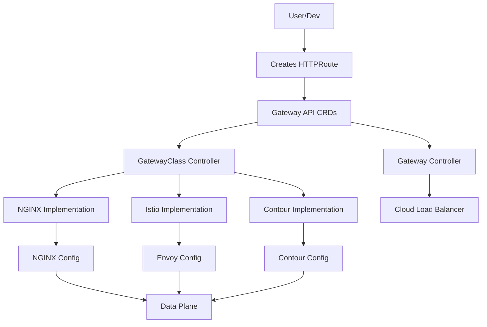

# Gateway API vs Ingress Controller: Deep Dive into Complex Logic 🧠

## 🎯 **The Core Philosophical Difference**

### **Ingress Controller:** "WHERE should traffic go?"
```yaml
# Ingress thinks: Match path → Send to service
apiVersion: networking.k8s.io/v1
kind: Ingress
spec:
  rules:
  - host: api.example.com
    http:
      paths:
      - path: /users
        backend:
          service:
            name: user-service
            port: 80
```

### **Gateway API:** "WHAT should happen to traffic?"
```yaml
# Gateway API thinks: Analyze request → Apply logic → Route intelligently
apiVersion: gateway.networking.k8s.io/v1
kind: HTTPRoute
spec:
  rules:
  - matches:                    # WHAT to look for
    - headers:
      - name: X-User-Type
        value: premium
      path:
        value: /api/users
    filters:                    # WHAT transformations to apply
    - type: RequestHeaderModifier
      requestHeaderModifier:
        add:
        - name: X-Priority
          value: "high"
    - type: URLRewrite
      urlRewrite:
        path:
          type: ReplaceFullPath
          replaceFullPath: /vip/users
    backendRefs:                # WHERE to send (with intelligence)
    - name: premium-service
      port: 8080
      weight: 100
```

---

## 🔄 **Complex Logic Examples: Side-by-Side Comparison**

### **Example 1: A/B Testing with Header-based Routing**

#### **Ingress Controller (Hacky, Limited)**
```yaml
# Can't do this natively! Need annotations + custom templates
apiVersion: networking.k8s.io/v1
kind: Ingress
metadata:
  annotations:
    nginx.ingress.kubernetes.io/configuration-snippet: |
      if ($http_x_experiment_group = "new-ui") {
        set $proxy_upstream "new-ui-service.default.svc.cluster.local:80";
      }
      if ($http_x_experiment_group = "old-ui") {
        set $proxy_upstream "old-ui-service.default.svc.cluster.local:80";
      }
spec:
  rules:
  - http:
      paths:
      - path: /
        backend:
          service:
            name: default-service  # Dummy
            port: 80
```

**Problems:**
- Vendor-specific annotations
- Hard-coded service names
- Error-prone configuration snippets
- No validation

#### **Gateway API (Native, Clean)**
```yaml
apiVersion: gateway.networking.k8s.io/v1
kind: HTTPRoute
metadata:
  name: ab-testing
spec:
  parentRefs:
  - name: main-gateway
  rules:
  # Group A: New UI (header-based)
  - matches:
    - headers:
      - type: Exact
        name: X-Experiment-Group
        value: "new-ui"
    backendRefs:
    - name: new-ui-service
      port: 80
  
  # Group B: Old UI (cookie-based)
  - matches:
    - headers:
      - type: Exact
        name: Cookie
        value: ".*exp_group=old.*"  # Regex matching!
    backendRefs:
    - name: old-ui-service
      port: 80
  
  # Default: Split traffic 50/50
  - backendRefs:
    - name: new-ui-service
      port: 80
      weight: 50
    - name: old-ui-service
      port: 80
      weight: 50
```

**Advantages:**
- Native header matching
- Regex support in matches
- Weight-based traffic splitting
- Clear, structured configuration

---

### **Example 2: API Versioning with Complex Logic**

#### **Scenario:** Route based on:
1. URL path prefix (`/api/v1`, `/api/v2`)
2. Header (`X-API-Version`)
3. Query parameter (`?version=v2`)
4. Default to v1

#### **Ingress Controller (Impossible as single resource)**
```yaml
# Need MULTIPLE Ingress resources + complex rewrites
apiVersion: networking.k8s.io/v1
kind: Ingress
metadata:
  name: api-v1
  annotations:
    nginx.ingress.kubernetes.io/rewrite-target: /$2
spec:
  rules:
  - host: api.example.com
    http:
      paths:
      - path: /api/v1(/|$)(.*)
        backend:
          service:
            name: api-v1-service
---
apiVersion: networking.k8s.io/v1
kind: Ingress
metadata:
  name: api-v2
  annotations:
    nginx.ingress.kubernetes.io/configuration-snippet: |
      # Header-based routing hack
      if ($http_x_api_version = "v2") {
        rewrite ^/api/(.*)$ /$1 break;
        proxy_pass http://api-v2-service;
      }
spec:
  rules:
  - host: api.example.com
    http:
      paths:
      - path: /api/v2(/|$)(.*)
        backend:
          service:
            name: api-v2-service
```

**Problems:**
- Multiple resources
- Inconsistent configuration
- No priority ordering
- Fragile configuration snippets

#### **Gateway API (Single resource, clear logic)**
```yaml
apiVersion: gateway.networking.k8s.io/v1
kind: HTTPRoute
metadata:
  name: api-versioning
spec:
  parentRefs:
  - name: api-gateway
  hostnames:
  - "api.example.com"
  rules:
  # Rule 1: Explicit v2 in header (highest priority)
  - matches:
    - headers:
      - type: Exact
        name: X-API-Version
        value: "v2"
    filters:
    - type: RequestHeaderModifier
      requestHeaderModifier:
        remove: ["X-API-Version"]
    backendRefs:
    - name: api-v2-service
      port: 8080
  
  # Rule 2: Explicit v2 in query param
  - matches:
    - queryParams:
      - type: Exact
        name: version
        value: "v2"
    filters:
    - type: RequestRedirect
      requestRedirect:
        removeQueryParams: ["version"]
    backendRefs:
    - name: api-v2-service
      port: 8080
  
  # Rule 3: Path-based v2
  - matches:
    - path:
        type: PathPrefix
        value: /api/v2
    filters:
    - type: URLRewrite
      urlRewrite:
        path:
          type: ReplacePrefixMatch
          replacePrefixMatch: /
    backendRefs:
    - name: api-v2-service
      port: 8080
  
  # Rule 4: Path-based v1
  - matches:
    - path:
        type: PathPrefix
        value: /api/v1
    filters:
    - type: URLRewrite
      urlRewrite:
        path:
          type: ReplacePrefixMatch
          replacePrefixMatch: /
    backendRefs:
    - name: api-v1-service
      port: 8080
  
  # Rule 5: Default (catch-all)
  - matches:
    - path:
        type: PathPrefix
        value: /api
    filters:
    - type: URLRewrite
      urlRewrite:
        path:
          type: ReplacePrefixMatch
          replacePrefixMatch: /
    backendRefs:
    - name: api-v1-service  # Default to v1
      port: 8080
```

**Key Insights:**
- **Priority**: Rules evaluated in order (top to bottom)
- **Clean separation**: Each rule has clear purpose
- **Built-in filters**: No custom snippets needed
- **Single resource**: All logic in one place

---

### **Example 3: Multi-Tenant SaaS Application**

#### **Scenario:** Different routing based on:
1. Subdomain (`tenant1.app.com`, `tenant2.app.com`)
2. Path prefix (`/admin`, `/api`, `/app`)
3. Tenant-specific backends
4. Global shared services

#### **Ingress Controller (Complex, Fragile)**
```yaml
# Would need separate Ingress for each tenant or complex rewrites
apiVersion: networking.k8s.io/v1
kind: Ingress
metadata:
  name: multi-tenant
  annotations:
    nginx.ingress.kubernetes.io/server-snippet: |
      # Extract tenant from host
      set $tenant "";
      if ($host ~* ^([a-z0-9-]+)\.app\.com$) {
        set $tenant $1;
      }
      
      # Route to tenant-specific services
      location ~ ^/api/(.*)$ {
        if ($tenant = "tenant1") {
          proxy_pass http://tenant1-api-service/$1;
        }
        if ($tenant = "tenant2") {
          proxy_pass http://tenant2-api-service/$1;
        }
        # ... and so on for each tenant
      }
spec:
  rules:
  - host: "*.app.com"
    http:
      paths:
      - path: /
        backend:
          service:
            name: default-placeholder
```

**Problems:**
- Configuration explosion
- Hard-coded tenant logic
- Difficult to maintain
- No tenant isolation

#### **Gateway API (Elegant, Scalable)**
```yaml
# Infrastructure Team: Creates shared gateway
apiVersion: gateway.networking.k8s.io/v1
kind: Gateway
metadata:
  name: saas-gateway
  namespace: infrastructure
spec:
  gatewayClassName: shared-gateway
  listeners:
  - name: wildcard
    port: 80
    protocol: HTTP
    hostname: "*.app.com"

# Tenant 1 Team: Manages their own routes
apiVersion: gateway.networking.k8s.io/v1
kind: HTTPRoute
metadata:
  name: tenant1-routes
  namespace: tenant1  # Each tenant in their own namespace
spec:
  parentRefs:
  - name: saas-gateway
    namespace: infrastructure
  hostnames:
  - "tenant1.app.com"
  rules:
  - matches:
    - path:
        type: PathPrefix
        value: /api
    backendRefs:
    - name: api-service
      namespace: tenant1  # Cross-namespace reference!
      port: 8080
  - matches:
    - path:
        type: PathPrefix
        value: /admin
    backendRefs:
    - name: admin-service
      namespace: tenant1
      port: 8080
  - backendRefs:  # Default route
    - name: app-service
      namespace: tenant1
      port: 3000

# Tenant 2 Team: Same pattern, different namespace
apiVersion: gateway.networking.k8s.io/v1
kind: HTTPRoute
metadata:
  name: tenant2-routes
  namespace: tenant2
spec:
  parentRefs:
  - name: saas-gateway
    namespace: infrastructure
  hostnames:
  - "tenant2.app.com"
  rules: ...  # Tenant 2's specific routes

# Security: ReferenceGrant for cross-namespace access
apiVersion: gateway.networking.k8s.io/v1beta1
kind: ReferenceGrant
metadata:
  name: allow-tenants-to-gateway
  namespace: infrastructure
spec:
  from:
  - group: gateway.networking.k8s.io
    kind: HTTPRoute
    namespace: tenant1
  - group: gateway.networking.k8s.io
    kind: HTTPRoute
    namespace: tenant2
  to:
  - group: gateway.networking.k8s.io
    kind: Gateway
```

**Architecture Benefits:**
- **Namespace isolation**: Each tenant isolated
- **Self-service**: Tenants manage their own routes
- **Security**: Explicit cross-namespace grants
- **Scalability**: Add tenants without touching gateway

---

### **Example 4: Advanced Traffic Management**

#### **Scenario:** Smart routing with:
1. Circuit breaking
2. Retry policies
3. Timeout configuration
4. Request mirroring
5. Rate limiting

#### **Ingress Controller (Vendor-specific, Limited)**
```yaml
apiVersion: networking.k8s.io/v1
kind: Ingress
metadata:
  annotations:
    # NGINX-specific annotations
    nginx.ingress.kubernetes.io/proxy-connect-timeout: "10"
    nginx.ingress.kubernetes.io/proxy-read-timeout: "30"
    nginx.ingress.kubernetes.io/proxy-send-timeout: "30"
    nginx.ingress.kubernetes.io/limit-rps: "10"
    nginx.ingress.kubernetes.io/configuration-snippet: |
      # Custom retry logic
      proxy_next_upstream error timeout http_502 http_503;
      proxy_next_upstream_tries 3;
      
      # Request mirroring hack
      mirror /mirror;
      mirror_request_body on;
    nginx.ingress.kubernetes.io/server-snippet: |
      location = /mirror {
        internal;
        proxy_pass http://mirror-service$request_uri;
      }
spec:
  rules: ...
```

**Problems:**
- Vendor lock-in
- Inconsistent annotation names
- Complex snippets
- Limited functionality

#### **Gateway API (Standardized, Extensible)**
```yaml
apiVersion: gateway.networking.k8s.io/v1
kind: HTTPRoute
metadata:
  name: advanced-routing
spec:
  parentRefs:
  - name: production-gateway
  rules:
  - matches:
    - path:
        type: PathPrefix
        value: /api
    # FILTER CHAIN - Sequential processing
    filters:
    # 1. Rate limiting
    - type: ExtensionRef
      extensionRef:
        group: policy.gateway.networking.k8s.io
        kind: RateLimitPolicy
        name: api-rate-limit
    
    # 2. Request modification
    - type: RequestHeaderModifier
      requestHeaderModifier:
        set:
        - name: X-Request-ID
          value: "{{uuid}}"
        add:
        - name: X-Forwarded-For
          value: "{{client_ip}}"
    
    # 3. Request mirroring (for debugging)
    - type: RequestMirror
      requestMirror:
        backendRef:
          name: debug-service
          port: 8080
          weight: 100  # 100% of traffic mirrored
    
    # 4. URL rewriting
    - type: URLRewrite
      urlRewrite:
        path:
          type: ReplacePrefixMatch
          replacePrefixMatch: /v1/api
    
    backendRefs:
    - name: api-service
      port: 8080
      
      # BACKEND-SPECIFIC POLICIES
      filters:  # Filters that apply only to this backend
      - type: ExtensionRef
        extensionRef:
          group: policy.gateway.networking.k8s.io
          kind: RetryPolicy
          name: api-retry-policy
      - type: ExtensionRef
        extensionRef:
          group: policy.gateway.networking.k8s.io
          kind: TimeoutPolicy
          name: api-timeout-policy
      - type: ExtensionRef
        extensionRef:
          group: policy.gateway.networking.k8s.io
          kind: CircuitBreakerPolicy
          name: api-circuit-breaker
```

**Supporting Policy Resources:**
```yaml
# Rate Limit Policy (Extension)
apiVersion: policy.gateway.networking.k8s.io/v1alpha1
kind: RateLimitPolicy
metadata:
  name: api-rate-limit
spec:
  targetRef:
    group: gateway.networking.k8s.io
    kind: HTTPRoute
    name: advanced-routing
  rules:
  - clientSelectors:
    - headers:
      - name: X-API-Key
    limits:
    - count: 100
      duration: 1m

# Retry Policy
apiVersion: policy.gateway.networking.k8s.io/v1alpha1
kind: RetryPolicy
metadata:
  name: api-retry-policy
spec:
  targetRef:
    group: gateway.networking.k8s.io
    kind: BackendRef
    name: api-service
  retries: 3
  retryOn:
  - "5xx"
  - "gateway-error"
  - "connect-failure"
```

**Key Concept: Policy Attachment**
- Policies can target: Gateway, HTTPRoute, or BackendRef
- Separation of routing logic from policy logic
- Reusable policies across routes

---

### **Example 5: Real-time Analytics Pipeline**

#### **Scenario:** Route based on:
1. Content type (`application/json` vs `application/protobuf`)
2. Message size (small vs large payloads)
3. Priority headers
4. Geographic location

#### **Gateway API Solution:**
```yaml
apiVersion: gateway.networking.k8s.io/v1
kind: HTTPRoute
metadata:
  name: analytics-pipeline
spec:
  parentRefs:
  - name: analytics-gateway
  rules:
  # High-priority, small JSON payloads
  - matches:
    - headers:
      - type: Exact
        name: Content-Type
        value: "application/json"
      - type: Exact
        name: X-Priority
        value: "high"
    filters:
    - type: RequestHeaderModifier
      requestHeaderModifier:
        add:
        - name: X-Processing-Tier
          value: "realtime"
    backendRefs:
    - name: realtime-processor
      port: 8080
  
  # Large payloads (batch processing)
  - matches:
    - headers:
      - type: Exact
        name: Content-Type
        value: "application/json"
    filters:
    - type: ExtensionRef
      extensionRef:
        group: custom.company.io
        kind: SizeBasedRouter
        name: payload-router
    backendRefs: []  # Dynamic routing based on filter
  
  # Protobuf payloads (specialized processor)
  - matches:
    - headers:
      - type: Exact
        name: Content-Type
        value: "application/protobuf"
    filters:
    - type: URLRewrite
      urlRewrite:
        hostname: "protobuf-processor.internal"
    backendRefs:
    - name: protobuf-processor
      port: 8080
  
  # Geographic routing
  - matches:
    - headers:
      - type: Regex
        name: CF-IPCountry
        value: "^(EU|UK|DE)$"  # European traffic
    filters:
    - type: RequestHeaderModifier
      requestHeaderModifier:
        add:
        - name: X-Data-Location
          value: "eu-west"
    backendRefs:
    - name: eu-processor
      port: 8080
  
  # Default: US processing
  - backendRefs:
    - name: us-processor
      port: 8080
```

**Advanced Features Demonstrated:**
- **Header regex matching**
- **Custom extension filters**
- **Dynamic routing**
- **Hostname rewriting**
- **Geographic routing**

---

## 🧠 **The Mental Model Shift**

### **Ingress Controller Thinking:**
```
Request → [Path Match] → [Service]
           │
           └─ Simple if/else logic
```

### **Gateway API Thinking:**
```
Request → [Match Conditions] → [Filter Chain] → [Backend Selection]
           │                    │                 │
           ├─ Headers           ├─ Transform      ├─ Weighted
           ├─ Path              ├─ Modify         ├─ Health-aware
           ├─ Query params      ├─ Redirect       └─ Policy-bound
           ├─ Method            ├─ Mirror
           └─ AND/OR logic      └─ Extend
```

---

## 🔧 **Implementation Reality**

### **Gateway API: It's Actually MULTIPLE Controllers**


---

## 📊 **Capability Comparison Matrix**

| Capability | Ingress | Gateway API | Notes |
|------------|---------|-------------|-------|
| **AND/OR Conditions** | ❌ No | ✅ Yes | `matches` with multiple criteria |
| **Header-based Routing** | ❌ Limited | ✅ Native | Regex, exact, prefix matching |
| **Query Param Routing** | ❌ No | ✅ Yes | Exact, regex matching |
| **Method-based Routing** | ❌ No | ✅ Yes | GET, POST, PUT, etc. |
| **Weighted Traffic Split** | ❌ Hacky | ✅ Native | Built-in weight field |
| **Request Transformation** | ❌ Annotations | ✅ Filters | Header mod, URL rewrite, redirect |
| **Response Transformation** | ❌ Limited | ✅ Filters | Header modification |
| **Request Mirroring** | ❌ Snippets | ✅ Native | Built-in filter |
| **Circuit Breaking** | ❌ No | ✅ Policies | Through extensions |
| **Rate Limiting** | ❌ Annotations | ✅ Policies | Standardized |
| **Retry Logic** | ❌ Snippets | ✅ Policies | Configurable retry policies |
| **Timeout Control** | ❌ Annotations | ✅ Policies | Route/backend level |
| **Cross-namespace** | ❌ Limited | ✅ Native | With ReferenceGrant |
| **Protocol Support** | HTTP only | HTTP, TCP, TLS, gRPC | Multiple route types |
| **Priority Ordering** | ❌ No | ✅ Yes | Rule order matters |

---

## 🚀 **Migration Path: Complex Logic**

### **Before (Ingress - Monolithic Config):**
```yaml
# One giant Ingress with annotations
apiVersion: networking.k8s.io/v1
kind: Ingress
metadata:
  annotations:
    nginx.ingress.kubernetes.io/configuration-snippet: |
      # 200 lines of nginx config
      # Mixed routing logic
      # Vendor-specific hacks
```

### **After (Gateway API - Modular):**
```yaml
# 1. Gateway (infrastructure)
apiVersion: gateway.networking.k8s.io/v1
kind: Gateway
# ... gateway spec

# 2. Routing Logic (app team)
apiVersion: gateway.networking.k8s.io/v1
kind: HTTPRoute
# ... routing rules

# 3. Policies (platform team)
apiVersion: policy.gateway.networking.k8s.io/v1alpha1
kind: RateLimitPolicy
# ... rate limits

# 4. Extensions (custom needs)
apiVersion: extensions.company.io/v1
kind: CustomRouter
# ... custom logic
```

---

## 💡 **When Gateway API Shines**

### **Complex Use Cases Where Gateway API Excels:**
1. **Multi-tenant SaaS** → Namespace isolation + self-service
2. **A/B Testing** → Weighted routing + header matching
3. **API Versioning** → Multiple match criteria
4. **Geographic Routing** → Header-based + custom filters
5. **Content-based Routing** → Content-Type, size, etc.
6. **Migration Strategies** → Canary, blue-green
7. **Security Policies** → Rate limiting, authentication
8. **Observability** → Request mirroring, logging

### **When Ingress is Still Okay:**
- Simple path-based routing
- Quick prototypes
- Legacy applications
- When your team only knows Ingress

---

## 🎯 **The Bottom Line**

**Gateway API is NOT just "Ingress v2"** - it's a **completely different paradigm**:

| Aspect | Ingress | Gateway API |
|--------|---------|-------------|
| **Mindset** | "Route traffic" | "Orchestrate traffic flow" |
| **Architecture** | Monolithic config | Modular, layered |
| **Flexibility** | Limited, vendor-specific | Extensible, standardized |
| **Team Collaboration** | Centralized control | Role-based, self-service |
| **Complex Logic** | Configuration snippets | Native constructs |

**The real power:** Gateway API turns **infrastructure configuration** into **application intent declaration**. Instead of telling the system HOW to route, you tell it WHAT you want to achieve, and the system figures out the HOW.

---

## 🔮 **Future-Proof Your Infrastructure**

```yaml
# Today: Start with Gateway API
apiVersion: gateway.networking.k8s.io/v1
kind: HTTPRoute

# Tomorrow: Add policies
apiVersion: policy.gateway.networking.k8s.io/v1
kind: RetryPolicy

# Future: Custom extensions
apiVersion: wasm.gateway.networking.k8s.io/v1
kind: WASMFilter

# The pattern: Declarative → Programmatic → Intelligent
```

**Start simple, add complexity as needed.** Gateway API grows with your requirements, while Ingress hits a wall quickly with complex logic.

**Your infrastructure should understand your business logic, not just your network paths.** That's the Gateway API promise. 🚀